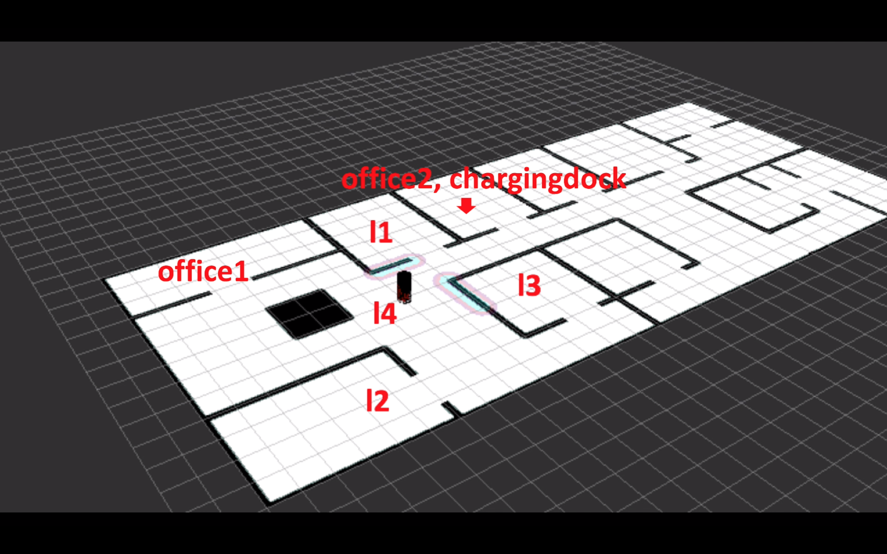

# PROMISE: A Domain-Specific Language to specify high-level missions for multi-robots

# Authors
- Sergio García - sergio.garcia@gu.se
- Patrizio Pelliccione - patrizio.pelliccione@cse.gu.se
- Claudio Menghi - claudio.menghi@gu.se
- Thorsten Berger - thorsten.berger@gu.se
- Tomas Bures - bures@d3s.mff.cuni.cze

# PROMISE organization

In this repository we provide the implementation of PROMISE, our tool for multi-robot mission specification. The contents are mainly divided in two groups:

1. The software corresponding to the DSL, which is mainly instantiated as an Eclipse workspace (/PROMISE_implementation/CentralStation/workspace):

	* A meta-model of the system, where operators are defined in a modular way, inheriting characteristics from an abstract class. It permits an easy way of implementing new operators if needed.

	* The DSL, implemented in Xtext and Sirius, (both can be integrated into the same workbench), what permits the mission definition in parallel in both visual and textual fashions. This is indeed a helpful feature since, for instance, while text is able to carry more detailed information, a diagram highlights the relationship between elements much better.

	* An Xtend script (/PROMISE_implementation/CentralStation/workspace/org.xtext.missionrobots.Mission/src/org/xtext/missionrobots/generator/MissionGenerator.xtend), which automatically generates a mission tree in LTL. This mission tree is sent to each robot, where an appropriate choreographer manages it.

    * We provide a set of plugins for all the previous bullets to simplify the installation (PROMISE_implementation/CentralStation/workspace/plugins).

	* A Java executable which sends a mission tree to each corresponding robot, previously defined by the DSL. Its maven package is allocated in (/PROMISE_implementation/CentralStation/CentralStation). When executed, it sends the mission to each correspinding robot. The IP and ports corresponding with your robots can be edit in the file (/PROMISE_implementation/CentralStation/CentralStation/src/main/java/se/gu/CentralStation/ReadWithScanner.java). After you saved your changes, you have to build the maven package again using Eclipse. We already proivide a .jar file for simulation. It assumes that the local machine will forward the missions to the robotic team, starting from the port 13000. The Eclipse environment can be configured to simplify the execution of the produced .jar file (e.g., https://help.eclipse.org/kepler/index.jsp?topic=%2Forg.eclipse.platform.doc.user%2FgettingStarted%2Fqs-97_standalone_ets.htm)

    
2. We also provide an implementation to test our work using either real robots or via simulation. For the current implementation of PROMISE we use the ROS middleware to manage the communication between the software components allocated within each robot. The ROS pachages are allocated in (/PROMISE_implementation/sera). We developed two software components:

	* Communication and collaboration manager. It serves as a proxy between the Service-Oriented Architecture paradigm of communication and the ROS environment. 

	* Local mission manager. It encapsulates a high-level choreographer for the mission tree within each robot. The choreographer is the component in charge of reading the lines of the mission tree, choosing the correct branch and going through its set of tasks. 

# Usage of PROMISE

First, the mission specifier needs the Ecplise IDE (https://www.eclipse.org/) to be installed along with Xtext (https://www.eclipse.org/Xtext/) and Sirius (https://www.eclipse.org/sirius/) modelling tools. The current implementation of PROMISE and its implementation relies on ROS (https://www.ros.org/). A planner able to understand LTL formulas as input must be executed as well, for instance (https://github.com/MengGuo/P_MAS_TG). We provide a Virtual Machine which already contains all the necesary software to run robotic missions in: https://gubox.box.com/s/mn05g0ipbjdgebncw6r7srpk816lqkus

The Guidelines.pdf file contains detailed information not only about the instalation of the Virtual Machine but also about the usage of PROMISE.